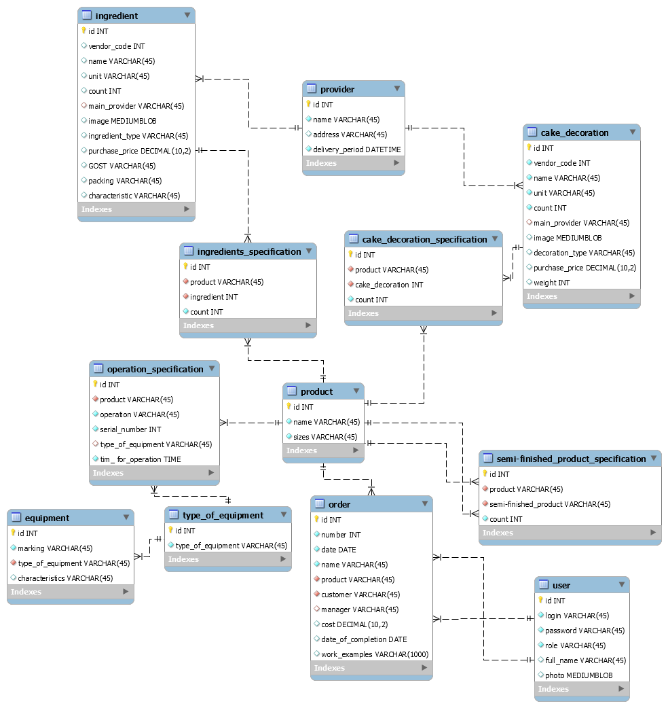

# Проект по практике
## Задание 1: Создайте  форму  для  авторизации  зарегистрированных пользователей
### Подключение к БД
Был создан класс `DBUtils` с классом `public static MySqlConnection GetDBConnection()`, который возвращает объект `MySqlConnection` с установленными свойствами подключения.
### Авторизация пользователей
При нажатии кнопки на главной странице программы в БД запрос, который ищет пару логин/пароль и возвращает все атрибуты пользователя. Если программа 3 раза не находит соответствующую запись, то элементы формы блокируются на 5 секунд. 
Рисунок 1 — Успешный вход
 
Рисунок 2 — Ошибка входа

### Создание индивидуальных страниц для должностей
После входа программа оператором `switch` для атрибута `role` определяет, какую страницу открыть. Пока что все индивидуальные страницы содержат только кнопку "Закрыть", которая закрывает индивидуальную страницу, т. е. переходит на страницу авторизации.
Рисунок 3 — Страница "Экран заказчика"
 
Код кнопки "Закрыть":
<code>
private void Button_Click(object sender, RoutedEventArgs e)
{Window.GetWindow(this).Content = new MainPage();}
</code>
## Задание 2: Создайте форму для регистрации заказчиков
Рисунок 4 — Форма регистрации заказчиков
 
Рисунок 5 — Попытка создания пользователя с уже существующим логином
 
Рисунок 6 — Попытка создания пользователя с паролем, несоответствующим требованиям
 
Рисунок 7 — Успешное создание пользователя
 
Рисунок 8 — Созданная запись в БД
 
## Задание 3: Создайте форму для учета инструментов
Рисунок 9 — Вход в форму учета инструментов через страницу директора

 
Рисунок 10 — Добавление инструмента через форму учета инструментов

 
Рисунок 11 — Инструмент успешно добавлен и выведен

 
## Задание 4: Создайте форму учета ингредиентов и украшений для тортов
Рисунок 12 — Изменение записи в таблице "Ингдредиенты" через учетную запись директора

 
Рисунок 13 — Просмотр записей в таблице "Ингдредиенты" через учетную запись мастера

 
Рисунок 14 — Удаление записи из таблицы "Ингдредиенты" через учетную запись директора

 
Рисунок 15 — Изменение записи в таблице "Ингдредиенты" через учетную запись директора

 
Рисунок 16 — Просмотр записей в таблице "Украшения для торта" через учетную запись мастера

 
Рисунок 17 — Удаление записи из таблицы "Украшения для торта" через учетную запись директора

 

## Структура базы данных

Рисунок 18 — Структура базы данных

